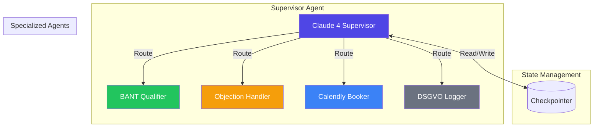
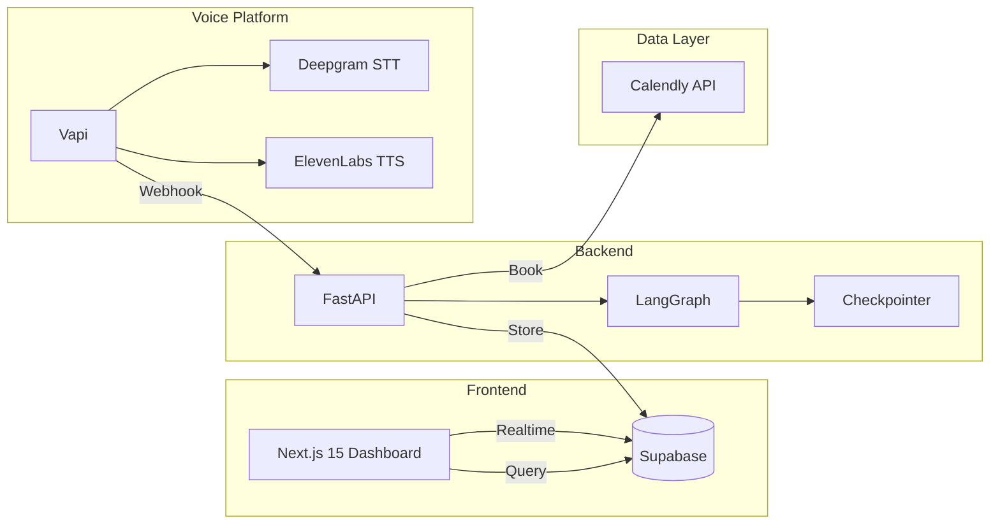

# 🤖 Everlast Voice Agent

[](https://opensource.org/licenses/MIT)
[](https://www.python.org/downloads/)
[](https://fastapi.tiangolo.com)
[](https://nextjs.org/)

> **AI Voice Agent für B2B Lead-Qualifizierung**
> Ein produktionsreifer Voice Agent, der 24/7 eingehende Anrufe entgegennimmt, Leads nach BANT-Kriterien qualifiziert und automatisch Demo-Termine bucht.


## ✨ Features

### 🎯 Core Capabilities
- **Natürliche Gesprächsführung** - Kontextuelles Verständnis, Rückfragen, kein starres Skript
- **BANT-Qualifizierung** - Budget, Authority, Need, Timeline + Everlast-spezifische Kriterien
- **Objection-Handling** - Professionelle Einwandbehandlung mit deutschen Sales-Patterns
- **Automatische Terminbuchung** - Direkte Calendly-Integration
- **DSGVO-Compliance** - Consent-Management, EU-Region, Zero-Retention

### 🧠 AI Architecture


### 📊 Real-time Dashboard
- **Conversion Rate** - Live-Tracking der Terminbuchungsrate (Ziel: ≥35%)
- **Lead-Scoring** - A/B/C-Verteilung qualifizierter Leads
- **Gesprächsanalyse** - Ø Call-Dauer, Drop-off Points, Einwände
- **Sentiment-Tracking** - Echtzeit-Emotionsanalyse

## 🏗️ Architecture



## 🚀 Quick Start

### Prerequisites
- Python 3.11+
- Node.js 20+
- Railway CLI: `npm install -g @railway/cli`
- Vercel CLI: `npm install -g vercel`
- Supabase CLI: `npm install -g supabase`

### Installation

```bash
# Clone repository
git clone https://github.com/ProfRandom92/everlast-voice-agent.git
cd everlast-voice-agent

# Setup environment
cp .env.example .env
# Edit .env with your API keys

# Install dependencies
cd api && pip install -r requirements.txt
cd ../dashboard && npm install
```

### Deployment

```bash
# Deploy backend
cd api
railway login
railway up

# Deploy dashboard
cd ../dashboard
vercel --prod

# Push database schema
supabase login
supabase db push
```

## 📖 Documentation

- [Architecture](docs/architecture.md) - System architecture and data flow
- [Deployment](DEPLOY.md) - Detailed deployment guide
- [Demo Script](docs/demo-script.md) - Demo call script
- [Test Scenarios](tests/scenarios.md) - 10 test scenarios

## 🔧 Configuration

### Environment Variables

| Variable | Description | Required |
|----------|-------------|----------|
| `VAPI_API_KEY` | Vapi API key | ✅ |
| `ANTHROPIC_API_KEY` | Claude API key | ✅ |
| `SUPABASE_URL` | Supabase project URL | ✅ |
| `SUPABASE_SERVICE_KEY` | Supabase service role key | ✅ |
| `CALENDLY_API_KEY` | Calendly API key | ✅ |
| `ELEVENLABS_API_KEY` | ElevenLabs API key (optional) | ❌ |

## 📊 Monitoring

### Health Check
```bash
curl https://everlast-voice-agent-production.up.railway.app/health
```

### Dashboard
Access the real-time dashboard at: `https://everlast-dashboard.vercel.app`

## 🤝 Contributing

1. Fork the repository
2. Create a feature branch: `git checkout -b feature/amazing-feature`
3. Commit changes: `git commit -m 'Add amazing feature'`
4. Push to branch: `git push origin feature/amazing-feature`
5. Open a Pull Request

## 📄 License

This project is licensed under the MIT License - see the [LICENSE](LICENSE) file for details.

## 🙏 Acknowledgments

- [Vapi](https://vapi.ai/) for voice infrastructure
- [LangGraph](https://langchain-ai.github.io/langgraph/) for agent orchestration
- [Claude](https://anthropic.com/claude) for LLM capabilities
- [Supabase](https://supabase.com/) for database infrastructure

---

<div align="center">

**[⬆ Back to Top](#-everlast-voice-agent)**

Made with ❤️ by the Everlast Team

</div>
