# 🤖 Everlast Voice Agent

[]()
[]()
[](https://opensource.org/licenses/MIT)
[](https://www.python.org/downloads/)
[](https://fastapi.tiangolo.com)
[](https://nextjs.org/)

> **🏆 Everlast Challenge 2026: AI Voice Agent für B2B Lead-Qualifizierung**
>
> Ein produktionsreifer Voice Agent, der 24/7 eingehende Anrufe entgegennimmt, Leads nach BANT-Kriterien qualifiziert und automatisch Demo-Termine bucht.
>
> **Für:** [Everlast Consulting](https://everlast.consulting) | **Challenge:** Voice Agent Implementation 2026

---

## 🎬 Showcase Video


*Animierte Demo des Voice Agents mit BANT-Qualifizierung und Live-Sentiment-Analysis*

---

## 🎬 Live Demo

```mermaid
graph LR
    A[📞 Anrufer] -->|"Guten Tag"| B[🤖 Anna]
    B -->|"Haben Sie 2 Minuten?"| A
    A -->|"Ja, ich bin interessiert"| B
    B -->|BANT-Qualifizierung| C[(💾 Speichern)]
    C -->|Score: A| D[📅 Termin buchen]
    D -->|Bestätigung| A
```



---

## 🏗️ System Architecture


---

## 🧩 Multi-Agent Architecture

```mermaid
flowchart TB
    subgraph "🎯 Supervisor Agent"
        S[Claude 4 Supervisor]
        S -->|Route| A1
        S -->|Route| A2
        S -->|Route| A3
        S -->|Route| A4
    end

    subgraph "🔧 Specialized Agents"
        A1[BANT Qualifier]
        A2[Objection Handler]
        A3[Calendly Booker]
        A4[DSGVO Logger]
    end

    subgraph "💾 State Management"
        CP[(Checkpointer)]
        S <-->|Read/Write| CP
    end

    style S fill:#4f46e5,color:#fff
    style A1 fill:#22c55e,color:#fff
    style A2 fill:#f59e0b,color:#fff
    style A3 fill:#3b82f6,color:#fff
    style A4 fill:#6b7280,color:#fff
```



---

## 🛠️ Tech Stack


---

## 🚀 Quick Start

### Prerequisites
- Python 3.11+
- Node.js 20+
- Railway CLI: `npm install -g @railway/cli`
- Vercel CLI: `npm install -g vercel`
- Supabase CLI: `npm install -g supabase`

### Installation

```bash
# Clone repository
git clone https://github.com/ProfRandom92/everlast-voice-agent.git
cd everlast-voice-agent

# Setup environment
cp .env.example .env
# Edit .env with your API keys

# Install dependencies
cd api && pip install -r requirements.txt
cd ../dashboard && npm install
```

### Deployment

```bash
# Deploy backend
cd api
railway login
railway up

# Deploy dashboard
cd ../dashboard
vercel --prod

# Push database schema
supabase login
supabase db push
```

---

## 🚀 Deployment

The Everlast Voice Agent is successfully deployed and running on Railway.

### Production URL

**Base URL:** `https://everlast-voice-agent-production.up.railway.app`

### Verification

To verify the deployment is active:

```bash
curl https://everlast-voice-agent-production.up.railway.app/health
```

Expected response:
```json
{
  "status": "healthy",
  "timestamp": "2026-02-26T12:00:00Z",
  "version": "1.0.0"
}
```

### Environment

- **Platform:** Railway
- **Region:** Europe (EU)
- **Runtime:** Python 3.11
- **Framework:** FastAPI + LangGraph

---

## 📖 Documentation

- [Architecture](docs/architecture.md) - System architecture and data flow
- [Deployment](DEPLOY.md) - Detailed deployment guide
- [Demo Script](docs/demo-script.md) - Demo call script
- [Test Scenarios](tests/scenarios.md) - 10 test scenarios

---

## 🔌 API Endpoints

The following REST API endpoints are available on the production deployment:

### Health Check

**GET** `/health`

Returns the current health status of the application.

**Response:**
```json
{
  "status": "healthy",
  "timestamp": "2026-02-26T12:00:00Z",
  "version": "1.0.0"
}
```

---

### Vapi Webhook

**POST** `/vapi/webhook`

Main webhook endpoint for Vapi voice platform integration. Receives call events, transcripts, and tool execution requests.

**Headers:**
- `Content-Type: application/json`

**Request Body:**
```json
{
  "message": {
    "type": "tool-calls",
    "tool_calls": [...],
    "call": {...}
  }
}
```

**Response:**
```json
{
  "results": [
    {
      "tool_call_id": "call_123",
      "result": "Success"
    }
  ]
}
```

---

### Get Conversation History

**GET** `/api/checkpoints/{phone}`

Retrieves the conversation history and state checkpoints for a specific phone number.

**Path Parameters:**
- `phone` (string, required): Phone number in E.164 format (e.g., `+49123456789`)

**Response:**
```json
{
  "phone_number": "+49123456789",
  "checkpoints": [
    {
      "id": "uuid",
      "timestamp": "2026-02-26T12:00:00Z",
      "bant_score": {...},
      "sentiment": "positive"
    }
  ]
}
```

---

### Conversion Statistics

**GET** `/api/stats/conversion`

Returns aggregate conversion statistics and BANT qualification metrics.

**Response:**
```json
{
  "total_calls": 150,
  "qualified_leads": 45,
  "conversion_rate": 0.30,
  "appointments_booked": 28,
  "average_bant_score": 3.2,
  "period": "2026-02-01 to 2026-02-26"
}
```

### Base URL

All endpoints are available at:
```
https://everlast-voice-agent-production.up.railway.app
```

---

## 🔄 LangGraph Integration

The voice agent uses LangGraph for stateful multi-agent orchestration.

### Architecture Overview


### State Management

The agent maintains conversation state using LangGraph's checkpointer:

- **Checkpoint ID:** Unique identifier for each conversation thread
- **Phone Number:** Used as the conversation thread identifier
- **State Persistence:** All BANT scores, objections, and booking data are persisted
- **Recovery:** Conversations can be resumed after interruption

### Supervisor Routing

The Supervisor agent (Claude 4) routes conversations to specialized agents:

| Agent | Purpose | Trigger |
|-------|---------|---------|
| BANT Qualifier | Qualify leads by Budget, Authority, Need, Timeline | Initial qualification needed |
| Objection Handler | Address concerns and objections | Negative sentiment detected |
| Calendly Booker | Schedule demo appointments | High BANT score achieved |
| DSGVO Logger | Record consent and privacy info | Data collection occurs |

### Checkpointer Configuration

```python
# SQLite-based persistence
from langgraph.checkpoint.sqlite import SqliteSaver

checkpointer = SqliteSaver(db_path="/data/checkpoints.db")
graph = workflow.compile(checkpointer=checkpointer)
```

---

## 🔧 Configuration

### Environment Variables

| Variable | Description | Required |
|----------|-------------|----------|
| `VAPI_API_KEY` | Vapi API key | ✅ |
| `ANTHROPIC_API_KEY` | Claude API key | ✅ |
| `SUPABASE_URL` | Supabase project URL | ✅ |
| `SUPABASE_SERVICE_KEY` | Supabase service role key | ✅ |
| `CALENDLY_API_KEY` | Calendly API key | ✅ |
| `ELEVENLABS_API_KEY` | ElevenLabs API key (optional) | ❌ |

---

## 📊 Monitoring

### Health Check
```bash
curl https://everlast-voice-agent-production.up.railway.app/health
```

### Dashboard
Access the real-time dashboard at: `https://everlast-dashboard.vercel.app`

---

## 🔧 Troubleshooting

### Common Issues and Fixes

#### 1. ToolExecutor Import Error

**Issue:** `ImportError: cannot import name 'ToolExecutor' from 'langgraph'`

**Cause:** ToolExecutor has been removed in newer versions of LangGraph.

**Fix:** Remove the ToolExecutor import and use the standard tool invocation pattern:

```python
# OLD (Not Working)
from langgraph import ToolExecutor

# NEW (Working)
# Tools are called directly within node functions
async def call_tools(state: dict, config: dict):
    tool_calls = state["messages"][-1].tool_calls
    results = []
    for tool_call in tool_calls:
        tool = tools_by_name[tool_call["name"]]
        result = await tool.ainvoke(tool_call["args"])
        results.append(result)
    return results
```

---

#### 2. Checkpoint ID Naming

**Issue:** `KeyError: 'checkpoint_id'` when resuming conversations

**Cause:** LangGraph changed the configuration key from `checkpoint_id` to `checkpoint_ns`.

**Fix:** Update all references from `checkpoint_id` to `checkpoint_ns`:

```python
# OLD
config = {"configurable": {"checkpoint_id": phone_number}}

# NEW
config = {"configurable": {"checkpoint_ns": phone_number}}
```

---

#### 3. Database Path Handling

**Issue:** `sqlite3.OperationalError: unable to open database file` in production

**Cause:** Hardcoded relative paths don't work in containerized environments.

**Fix:** Use environment-based path configuration with proper directory creation:

```python
# OLD
DB_PATH = "./data/checkpoints.db"

# NEW
import os

DB_PATH = os.environ.get("DATABASE_PATH", "/data/checkpoints.db")
os.makedirs(os.path.dirname(DB_PATH), exist_ok=True)
```

---

#### 4. Railway Deployment Health Check Failures

**Issue:** Application deploys but health checks fail

**Cause:** Port binding or startup time issues.

**Fix:** Ensure proper FastAPI configuration:

```python
# In main.py or app.py
import uvicorn

if __name__ == "__main__":
    port = int(os.environ.get("PORT", 8000))
    uvicorn.run(app, host="0.0.0.0", port=port)
```

---

#### 5. Vapi Webhook Timeouts

**Issue:** Webhook calls from Vapi timeout

**Cause:** LangGraph graph compilation or database queries taking too long.

**Fix:** Implement async processing and connection pooling:

```python
# Use async database connections
# Implement connection pooling for Supabase
# Cache compiled LangGraph workflows
```

---

### Debugging Tips

1. **Enable Debug Logging:**
   ```python
   import logging
   logging.basicConfig(level=logging.DEBUG)
   ```

2. **Check Railway Logs:**
   ```bash
   railway logs --follow
   ```

3. **Test Locally First:**
   ```bash
   cd api
   uvicorn main:app --reload
   curl http://localhost:8000/health
   ```

4. **Verify Environment Variables:**
   All required environment variables must be set in Railway dashboard.

---

## 🤝 Contributing

1. Fork the repository
2. Create a feature branch: `git checkout -b feature/amazing-feature`
3. Commit changes: `git commit -m 'Add amazing feature'`
4. Push to branch: `git push origin feature/amazing-feature`
5. Open a Pull Request

---

## 📄 License

This project is licensed under the MIT License - see the [LICENSE](LICENSE) file for details.

---

## 🙏 Acknowledgments

- [Vapi](https://vapi.ai/) for voice infrastructure
- [LangGraph](https://langchain-ai.github.io/langgraph/) for agent orchestration
- [Claude](https://anthropic.com/claude) for LLM capabilities
- [Supabase](https://supabase.com/) for database infrastructure

---

<div align="center">

**[⬆ Back to Top](#-everlast-voice-agent)**

Made with ❤️ for the Everlast Challenge 2026

</div>
